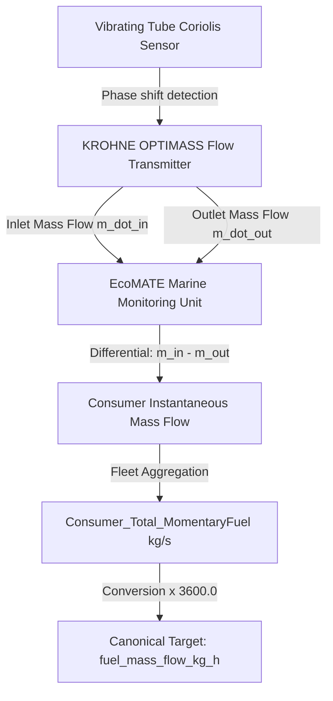

# 02 — Real Target Provenance & Measurement Lineage Report
**Phase:** 2.3 Real Maritime Data Validation  
**Document ID:** `02_REAL_TARGET_PROVENANCE.md`  
**Dataset:** FuelCast (`krohnedigital/FuelCast`)  
**Target Variable:** `Consumer_Total_MomentaryFuel`  
**Canonical Name:** `fuel_mass_flow_kg_h`  

---

## 1. Physical Sensor Apparatus & Operating Principle

In commercial marine propulsion systems, fuel is continuously circulated through a pressurized supply and return loop to maintain injection temperature and viscosity for heavy fuel oil (VLSFO) or marine gas oil (MDO).

```
                        +----------------------------------+
                        |  Fuel Day Tank (HFO/VLSFO/MDO)   |
                        +----------------------------------+
                                         |
                                         v
               +----------------------------------------------------+
               |    Inlet Coriolis Mass Flow Meter (OPTIMASS)       |
               |       measures mass flow entering: m_dot_in        |
               +----------------------------------------------------+
                                         |
                                         v
                         +-------------------------------+
                         |  Engine Fuel Rail / Injection |
                         |   (Main Engines / Boilers)    |
                         +-------------------------------+
                                         |  (Surplus recirculated fuel)
                                         v
               +----------------------------------------------------+
               |    Outlet Coriolis Mass Flow Meter (OPTIMASS)      |
               |       measures returning mass flow: m_dot_out      |
               +----------------------------------------------------+
                                         |
                                         v
                        +----------------------------------+
                        |     Return to Fuel Day Tank      |
                        +----------------------------------+
```

### Direct Industrial Coriolis Measurement
The KROHNE OPTIMASS meters utilize vibrating measuring tubes where fluid momentum induces a phase shift $\Delta \phi$ between inlet and outlet tube sections:
$$\Delta \phi \propto \dot{m}$$
This directly registers true **inertial mass flow rate** ($	ext{kg/s}$), entirely independent of fluid temperature, density variations, aeration, or Reynolds number.

### Differential Consumption Formulation
For each engine $k$:
$$\dot{m}_{	ext{consumed}, k}(t) = \dot{m}_{	ext{inlet}, k}(t) - \dot{m}_{	ext{outlet}, k}(t)$$

Total momentary vessel consumption is the exact physical sum across all propulsion and auxiliary consumers:
$$F_{	ext{total}}(t) = \sum_{k \in 	ext{engines}} \dot{m}_{	ext{consumed}, k}(t) + \sum_{j \in 	ext{boilers}} \dot{m}_{	ext{boiler}, j}(t)$$

---

## 2. Canonical Target Transformation

$$	ext{fuel\_mass\_flow\_kg\_h}(t) = 	ext{Consumer\_Total\_MomentaryFuel}(t) 	imes 3600.0$$

- Native Units: $	ext{kg/s}$ (double precision floating point)
- Platform Canonical Units: $	ext{kg/h}$
- Zero Circularity: The target is NOT reconstructed from shaft power, SFC curves, or speed polynomials.
- Classification: **`REAL_OBSERVED` (Tier 1 Physical Ground Truth)**.

---

## 3. End-to-End Measurement Lineage


