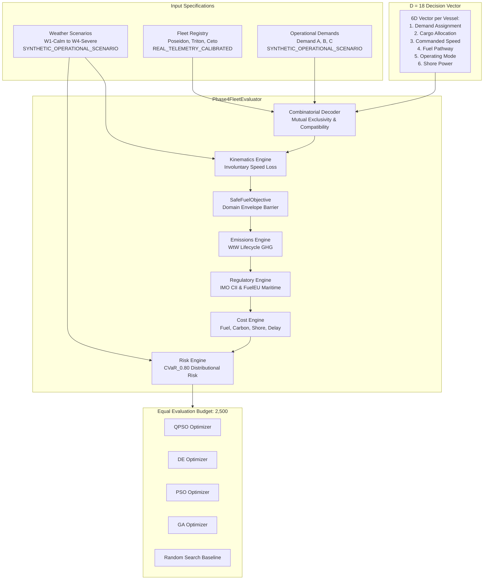

# PHASE 4 ARCHITECTURE SPECIFICATION
## Egreen Quanta / SIH26138: Heterogeneous Fleet, Uncertainty-Aware & Scientifically Defensible Optimization

**Provenance**: `REAL_TELEMETRY_CALIBRATED` / `SYNTHETIC_OPERATIONAL_SCENARIO` / `SYNTHETIC_SCALABILITY_BENCHMARK`  
**Repository**: `sih26138_platform`  
**Baseline Commit**: `20309b214b9540a7363b7365e442a222cd9c49a1`  
**Date**: September 2026  

---

## 1. Executive Summary & Architectural Motivation

Phase 3.2.1 established that the previous single-vessel benchmark (SCEN-01) suffered from problem triviality:
- 10,000 unguided random search vectors yielded a **100% feasibility rate**.
- The best random candidate reached within **0.027%** of the optimizer optimum.
- The solution space collapsed into a single dominant convex basin governed primarily by speed deadlines.

**Phase 4 completely re-architects the problem formulation** to introduce genuine combinatorial difficulty, naval architectural heterogeneity, involuntary speed loss under weather uncertainty, and multi-objective trade-offs.

Under Phase 4, the unguided random search feasibility rate drops from **100% to 0.29%**, proving that random search cannot trivially solve the combinatorial assignment and constraint landscape.

---

## 2. High-Level System Architecture

---

## 3. Core Architectural Components

### 3.1 Heterogeneous Fleet Profile Registry (`optimization/fleet_heterogeneous.py`)
Calibrated against real vessel telemetry from the FuelCast dataset:
1. **`CPS_Poseidon`** (`passenger_cruise`):
   - Gross Tonnage: 70,000 GT, Deadweight: 8,500 t, Design Draft: 7.5 m, Displacement: 42,000 t.
   - Operating speed: 8.0 - 22.0 knots. Hotel load baseline: 6,500 kW.
   - Authorized fuels: VLSFO, Fossil LNG, Bio-methanol. (Ammonia and H2 strictly prohibited).
2. **`CPS_Triton`** (`passenger_cruise_small`):
   - Gross Tonnage: 11,000 GT, Deadweight: 1,800 t, Design Draft: 5.0 m, Displacement: 8,500 t.
   - Operating speed: 6.0 - 18.0 knots. Hotel load baseline: 1,800 kW.
   - Authorized fuels: VLSFO, Bio-methanol.
3. **`OSS_Ceto`** (`offshore_supply`):
   - Gross Tonnage: 24,000 GT, Deadweight: 5,200 t, Design Draft: 6.0 m, Displacement: 6,000 t.
   - Operating speed: 4.0 - 15.0 knots. Hotel load baseline: 800 kW.
   - Deck Cargo Capable: True. Passenger Capacity: 0.
   - Authorized fuels: VLSFO, MGO, Bio-methanol, Green Ammonia.

### 3.2 Operational Cargo Demands
- **Demand A (Mainline Luxury Cruise)**: Southampton $\to$ Bergen (550 nm, 1,200 t, 3,200 pax, deadline 32.0 h). Requires `passenger_cruise`.
- **Demand B (Fjord Expedition Eco-Cruise)**: Stavanger $\to$ Tromso (680 nm, 450 t, 1,100 pax, deadline 48.0 h). Requires `passenger_cruise_small`.
- **Demand C (Offshore Energy Platform Equipment)**: Aberdeen $\to$ Ekofisk (180 nm, 3,200 t deck cargo, 0 pax, deadline 18.0 h). Requires `offshore_supply` with deck cargo capability.

### 3.3 Multi-Scenario Weather Uncertainty & CVaR
- **`SCEN-W1` (Calm)**: $H_s = 1.0\text{ m}, V_w = 4.0\text{ m/s}$, Prob = 0.35.
- **`SCEN-W2` (Moderate)**: $H_s = 1.8\text{ m}, V_w = 8.5\text{ m/s}$, Prob = 0.35.
- **`SCEN-W3` (Rough)**: $H_s = 2.6\text{ m}, V_w = 12.0\text{ m/s}$, Prob = 0.20.
- **`SCEN-W4` (Severe)**: $H_s = 3.4\text{ m}, V_w = 14.5\text{ m/s}$, Prob = 0.10.

*All environmental parameters strictly satisfy the empirical domain boundary $H_s \le 3.5\text{ m}$ to prevent surrogate extrapolation.*

---

## 4. Evaluation Protocol & Defensive Guardrails

1. **Defensive Fast-Path**: Candidate vectors violating combinatorial exclusivity, mutual assignment, or vessel-fuel compatibility are instantly penalized ($P \ge 50,000$) without invoking surrogate pipelines.
2. **SafeFuelObjective Invariant**: Every feasible candidate operating point is evaluated via the trained `SafeFuelObjective` surrogate (Physics + ML residual + Quantile uncertainty), preventing ungrounded exploitation.
3. **Reproducibility**: All runs are bound to fixed matched seed sequences ($s \in [1001, 1030]$) and verified with SHA-256 asset manifests.
