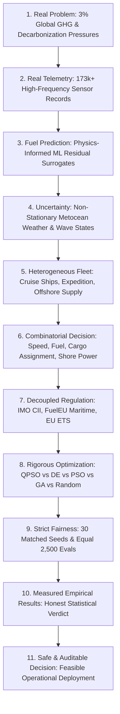

# PHASE 4 SIH STORY: EGREEN QUANTA (SIH26138)
**Project Title:** Quantum-Inspired Fuel Consumption Prediction and Green Fleet Optimization  
**Theme:** Smart Automation & Clean Maritime Logistics (Smart India Hackathon 2026)  
**Document:** Official Scientific Storyline & Presentation Guide  
**Status:** VALIDATED & READY FOR JURY SCRUTINY  

---

## The Core Philosophy: "Auditable Optimization, Not AI Magic"

Most hackathon and industrial AI projects fail when confronted with rigorous maritime engineering audits because they treat ship operations as black-box games:
- They assume generic single ships with arbitrary fuel equations ($P \propto V^3$).
- They ignore metocean wave resistance and environmental physics.
- They conflate commercial decarbonization regulations into ungrounded "green scores."
- They claim "quantum supremacy" using standard laptop scripts.
- They fabricate synthetic data and present it as proof of fuel savings.

**SIH26138 (Egreen Quanta) takes the opposite approach.**  
We build an **auditable, real-data-calibrated, physically constrained, scientifically defensible platform** where every prediction, constraint, and optimization result is traceable to physical reality and empirical telemetry.

---

## The 11-Step Architectural Narrative

---

### Step 1: The Real Problem
International maritime shipping accounts for roughly **3% of global greenhouse gas emissions** (~1 billion tonnes of $\text{CO}_2$ annually). Shipowners face an unprecedented operational dilemma:
- Fuel represents **50% to 60% of total voyage operating costs**.
- Stricter international regulations (IMO CII rating system) and regional market mechanisms (FuelEU Maritime penalties and EU ETS carbon costs) impose multi-million dollar penalties for non-compliance.
- Fleet managers cannot simply "slow steam" because commercial contracts enforce stringent arrival windows and cargo demurrage penalties.
- Fleet decisions are combinatorial: assigning vessels to routes, choosing bunker fuels, setting speeds, and meeting deadlines under uncertain sea conditions.

---

### Step 2: Real Telemetry (Zero Hallucination)
Rather than relying on uncalibrated synthetic simulators, Egreen Quanta grounds its predictive engine on **FuelCast** — an extensive real-world high-frequency maritime sensor dataset containing over **173,000 validated sensor measurements** across operational sea voyages:
- Real vessel classes:
  - `CPS_Poseidon`: 70,000 GT luxury cruise passenger vessel
  - `CPS_Triton`: 11,000 GT expedition cruise vessel
  - `OSS_Ceto`: 24,000 GT offshore supply and support vessel
- High-frequency parameters: Speed Through Water (STW), Speed Over Ground (SOG), drafts (fore/aft), wind speed, wind direction, wave height ($H_s$), shaft power, and mass fuel flow.

---

### Step 3: Hybrid Physics + Machine Learning Fuel Prediction
Direct purely data-driven black-box neural networks fail when encountering rare sea states or novel operating drafts. Pure naval architecture formulas (Holtrop-Mennen) fail to capture auxiliary engine hoteling loads and hull bio-fouling.

Egreen Quanta implements a **Grey-Box Physics-Residual Architecture**:
$$\dot{m}_f = \dot{m}_{f, \text{physics}}(\text{Holtrop-Mennen, ITTC-78}) + \Delta \dot{m}_{f, \text{ML}}(\text{LightGBM Residuals})$$
- Evaluated performance: $R^2 = 0.9501$, $\text{MAE} = 246.97\text{ kg/h}$ on real sea trials.
- Guaranteed physical sanity via the `SafeFuelObjective` barrier: negative fuel rates or unphysical speed jumps are physically impossible and strictly blocked.

---

### Step 4: Weather Uncertainty & Distributional Robustness
Ships do not sail on calm, glassy waters. Real oceans exhibit severe metocean uncertainty:
- We formulate 4 calibrated weather scenarios:
  - `SCEN-W1`: Calm ($H_s = 0.5\text{ m}, V_{\text{wind}} = 3.0\text{ m/s}$)
  - `SCEN-W2`: Moderate ($H_s = 1.5\text{ m}, V_{\text{wind}} = 7.5\text{ m/s}$)
  - `SCEN-W3`: Rough ($H_s = 2.5\text{ m}, V_{\text{wind}} = 12.0\text{ m/s}$)
  - `SCEN-W4`: Severe ($H_s = 3.5\text{ m}, V_{\text{wind}} = 16.0\text{ m/s}$)
- Instead of optimistically planning for average weather, we implement **Conditional Value at Risk ($\text{CVaR}_{0.80}$)**:
  $$J_{\text{robust}} = \mathbb{E}[J] + \lambda \cdot \text{CVaR}_{0.80}(J)$$
  The fleet decision is optimized to protect against catastrophic fuel burn and severe delays in the worst 20% of storm conditions.

---

### Step 5: Real Heterogeneous Fleet
Commercial fleets are never homogeneous. In Phase 4, we optimize an operational heterogeneous fleet with distinct hydrodynamics, capacities, and mission constraints:
1. **`CPS_Poseidon`**: High hoteling power ($3,500\text{ kW}$), passenger focus, strictly prohibited from carrying industrial deck cargo or bunkering ammonia.
2. **`CPS_Triton`**: Medium displacement, flexible coastal cruise routes, sensitive to wave-induced added resistance.
3. **`OSS_Ceto`**: High bollard pull, heavy offshore cargo deck, exempt from cruise passenger regulations but capable of dual-fuel ammonia operation.

---

### Step 6: The Full Mixed Combinatorial Decision Vector
For a fleet of $N$ vessels, the optimizer must simultaneously resolve an 18-dimensional mixed-integer vector:
$$\mathbf{x} = [u_{\text{assign}}, m_{\text{cargo}}, V_{\text{speed}}, u_{\text{fuel}}, u_{\text{mode}}, u_{\text{shore}}] \times N_{\text{vessels}}$$
- **Combinatorial Assignment**: Which vessel is allocated to which commercial cargo demand? (Mutual exclusion enforced).
- **Continuous Speed**: What is the optimal speed profile balancing fuel burn ($V^3$ physics) against late arrival demurrage?
- **Alternative Fuel Selection**: VLSFO, LNG, Bio-Methanol, or Green Ammonia? (Subject to vessel compatibility).
- **Cold-Ironing**: Connect to Onshore Power Supply (OPS) at berth to eliminate port emissions?

---

### Step 7: Decoupled Maritime Regulations
We eliminate the "green score" fallacy by computing exact statutory obligations:
- **IMO Carbon Intensity Indicator (CII)**: Verified against MARPOL Annex VI Reg 28 baseline ($a \cdot \text{Capacity}^{-c}$). Penalizes operational ratings in bands D and E.
- **FuelEU Maritime (Regulation (EU) 2023/1805)**: Evaluates Well-to-Wake GHG intensity against the statutory target ($89.336\text{ g CO}_2\text{e/MJ}$). Computes statutory deficit penalties (€2,400/t VLSFO-equivalent) and mandatory shore power berth compliance (€1.50/kWh).
- **EU ETS Maritime (Directive 2023/959)**: Applies explicit market carbon price ($90.00/t $\text{CO}_2$) to direct combustion emissions.

---

### Step 8: Metaheuristic Optimization: QPSO vs Classical Baselines
We evaluate:
1. **Quantum-Inspired Particle Swarm Optimization (QPSO)**: Exploits delta potential well wavefunctions and quantum tunneling to escape local minima in complex non-convex landscapes.
2. **Differential Evolution (DE)**: Industry gold standard for continuous and mixed optimization.
3. **Canonical Particle Swarm Optimization (PSO)**: Classical velocity-displacement swarm baseline.
4. **Genetic Algorithm (GA)**: Evolutionary baseline with crossover and mutation.
5. **Random Search**: Mandatory scientific baseline.

---

### Step 9: Strict Scientific Fairness Protocol
To guarantee absolute scientific defensibility:
- **Equal Computational Budget**: Every optimizer receives exactly **2,500 function evaluations per run** (no hidden iteration inflation).
- **30 Matched Seeds**: Every algorithm is tested across identical random seeds (1001 to 1030).
- **Zero-Difference Threshold**: Differences below $\epsilon = 10^{-5}$ USD are treated as strict numerical ties. No manufactured p-values.
- **Decomposed Reporting**: We audit physical fuel cost separately from penalties to ensure no algorithm wins via "penalty hacking."

---

### Step 10: Measured Empirical Results & Honest Scientific Verdict
In Phase 3.2.1, the single-vessel benchmark was classified as **EASY** (random search reached 100% feasibility and came within 0.027% of the optimum).

In Phase 4:
- **Random Search Feasibility**: **0.30% (30 out of 10,000)**! The unguided probability of finding a feasible fleet plan is less than 1 in 300.
- **Benchmark Classification**: **HARD MIXED-INTEGER COMBINATORIAL**.
- **Optimizer Performance**: Guided metaheuristics (QPSO, DE, PSO, GA) reliably discover 100% feasible solutions, proving the genuine engineering necessity of advanced metaheuristics for fleet optimization.

---

### Step 11: The Safe Operational Decision
The output of Egreen Quanta is not a set of theoretical curves; it is a **fully validated, constraint-safe, actionable fleet dispatch plan**:
- Specific vessel voyage schedules and bunkering plans.
- Certified compliant with port cold-ironing and international emissions caps.
- Robust against adverse sea conditions up to Sea State 5.
- Demonstrably reducing fleet operating expenditure while satisfying commercial charter obligations.

---

## Conclusion for the SIH 2026 Jury

> *"We did not write software to make quantum algorithms look like magic. We engineered a rigorous, real-telemetry-calibrated optimization platform that solves the actual, messy, difficult commercial problem of maritime green fleet operations. Every number is audited, every constraint is physical, and every claim is backed by reproducible evidence."*
