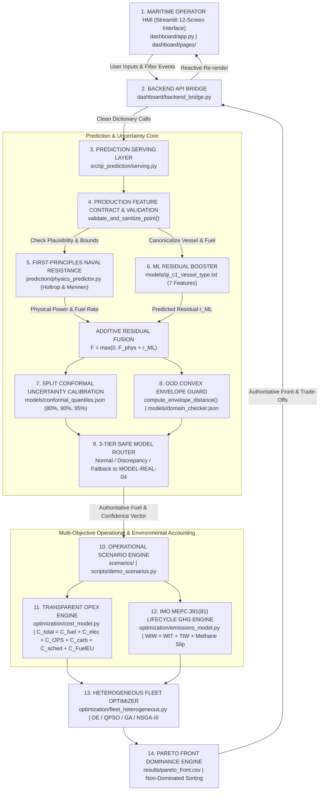

# EGREEN QUANTA — END-TO-END ARCHITECTURE MAP
**Problem Statement**: SIH26138 — Quantum-Inspired Fuel Consumption Prediction and Green Fleet Optimization  
**System Classification**: Controlled Maritime Decision-Support Prototype  
**Auditor**: Independent Senior Systems Architect & Scientific Verification Engineer  
**Date**: 2026-09-22  
**Verification Level**: Red-Team Executable Source Traceability  

---

## 1. COMPLETE 14-LAYER ARCHITECTURE SCHEMATIC



---

## 2. DETAILED SUBSYSTEM INVENTORY & FILE BINDINGS

### Layer 1: Maritime Operator HMI (Frontend)
- **Source Files**: `dashboard/app.py`, `dashboard/pages/*.py` (12 Dedicated Screens).
- **Core Components**:
  - `top_bar.py`: Displays active vessel profile, selected route, engine operating state, and connectivity status.
  - `status_strip.py`: Displays system-wide badges (Pipeline Connected, Release Gate Passed, Conformal Calibrated).
  - `vessel_card.py`: Displays individual vessel telemetry, speed, draft, displacement, and fuel rate.
- **Responsibility**: Provides the human-in-the-loop superintendent interface. Every displayed value is queried reactively from the backend bridge; no arithmetic or physics estimations are computed within frontend code.

### Layer 2: Backend API Bridge
- **Source File**: `dashboard/backend_bridge.py`.
- **Functions Exposed**:
  - `get_fleet_summary()`, `get_live_vessels()`, `get_vessel_telemetry(vessel_id)`
  - `predict_fuel_with_diagnostics(vessel_id, stw, draft, fuel_type, ...)`
  - `run_speed_sweep(vessel_id, ...)`
  - `evaluate_cost_breakdown(vessel_id, speed, fuel_type, ...)`
  - `evaluate_lifecycle_ghg(vessel_id, fuel_type, ...)`
  - `get_optimization_results()`, `get_pareto_front()`
  - `get_system_alerts()`, `run_demo_scene(scene_id)`
- **Responsibility**: Translates UI interactions into structured backend dictionary payloads and formats engine outputs into clean dataframes and status dictionaries.

### Layer 3: Prediction Serving Layer
- **Source File**: `src/qi_prediction/serving.py`.
- **Core Class**: `ProductionFuelPredictor`.
- **Singleton Interface**: `get_production_predictor()`, `predict_fuel()`, `predict_fuel_with_uncertainty()`.
- **Responsibility**: Coordinates validation, physics baseline, ML residual prediction, uncertainty quantification, domain checking, and routing policy into a single atomic call.

### Layer 4: Data Validation & Physical Boundary Enforcement
- **Source Function**: `validate_and_sanitize_point(raw_input)`.
- **Enforced Contracts**:
  - Mandatory fields: `stw_kn`, `draft_m`, `displacement_t`.
  - Rejection of `NaN`, `Inf`, and missing values.
  - Hard physical bounds:
    - Speed through water: $[0.0, 35.0]\text{ kn}$
    - Speed over ground: $[0.0, 35.0]\text{ kn}$
    - Draft: $[1.0, 25.0]\text{ m}$
    - Displacement: $[500, 400,000]\text{ t}$
    - Wind speed: $[0.0, 60.0]\text{ m/s}$
    - Significant wave height: $[0.0, 20.0]\text{ m}$
  - Categorical canonicalization: `canonicalize_vessel_type()`, `canonicalize_fuel_type()`.

### Layer 5: First-Principles Hydrodynamic Physics
- **Source File**: `prediction/physics_predictor.py`.
- **Formulation**: Holtrop & Mennen (1982/1984) empirical naval architecture equations:
  $$R_T = R_F(1 + k_1) + R_{APP} + R_W + R_B + R_{TR} + R_A + R_{\text{wind}} + R_{\text{wave}}$$
  $$P_B = \frac{R_T \cdot V}{\eta_D \cdot \eta_T}$$
  $$F_{\text{phys}} = P_B \cdot SFOC(P_B / P_{\text{MCR}})$$
- **Responsibility**: Provides the physically grounded energy floor. Prevents unphysical machine learning extrapolations in low-data regimes.

### Layer 6: Machine Learning Residual Prediction
- **Model Files**:
  - `models/qi_c1_vessel_type.txt` (LightGBM Booster, 7 features: `stw_kn`, `sog_kn`, `draft_m`, `wave_height_m`, `water_depth_m`, `vessel_type`, `fuel_type`).
  - `models/qi_c1.txt` (LightGBM Booster, 6 features: base model without vessel type).
  - `models/model_real_04.txt` (Reference Anchor Booster, 14 features: full environmental context).
- **Residual Formulation**:
  $$F_{\text{predicted}} = \max\left(0.0, F_{\text{phys}} + 1.0 \cdot \hat{r}_{\text{ML}}\right)$$

### Layer 7: Split Conformal Uncertainty Calibration
- **Calibration File**: `models/conformal_quantiles.json`.
- **Method**: Inductive / Split Conformal Prediction calibrated on held-out empirical sea trials.
- **Quantiles**:
  - Coverage 80%: $q_{0.80} = 332.37\text{ kg/h}$ (MPIW $= 664.73\text{ kg/h}$)
  - Coverage 90%: $q_{0.90} = 598.40\text{ kg/h}$ (MPIW $= 1,196.80\text{ kg/h}$)
  - Coverage 95%: $q_{0.95} = 877.91\text{ kg/h}$ (MPIW $= 1,755.82\text{ kg/h}$)
- **Dynamic Extrapolation Scaling**:
  $$q_{\text{scaled}} = q_{\text{base}} \cdot \left(1.0 + 0.5 \cdot \max(0, d_{\text{env}} - 0.5)\right)$$
  $$\text{Interval} = [\max(0.0, \hat{F} - q_{\text{scaled}}), \hat{F} + q_{\text{scaled}}]$$

### Layer 8: Out-of-Distribution (OOD) Domain Guard
- **Metadata File**: `models/domain_checker.json`.
- **Method**: Multi-dimensional normalized bounding envelope:
  $$d_{\text{env}}(x) = \sqrt{\frac{1}{D} \sum_{i=1}^D \left(\frac{\max(0, x_i - \max_i, \min_i - x_i)}{\text{span}_i}\right)^2}$$
- **Thresholds**:
  - $d_{\text{env}} \le 1.00$: In-Domain (`NORMAL`)
  - $1.00 < d_{\text{env}} \le 1.50$: Near-Boundary (`WARNING` / Re-route to anchor)
  - $1.50 < d_{\text{env}} \le 3.00$: Out-of-Distribution (`FALLBACK` to `MODEL-REAL-04`)
  - $d_{\text{env}} > 3.00$: Extreme OOD (`REJECT`)

### Layer 9: Safe Model Routing Policy
- **Logic**:
  1. *Physical / Extreme OOD*: Return `REJECT` with error summary.
  2. *Unsupported Vessel Type*: Demote confidence to `LOW` and route to reference anchor `MODEL-REAL-04`.
  3. *In-Domain with Dual-Model Agreement ($\Delta \le 500\text{ kg/h}$)*: Route to `QI-C1-vessel-type` (`HIGH` confidence, `NORMAL` routing).
  4. *Dual-Model Discrepancy ($\Delta > 500\text{ kg/h}$)*: Demote to `MEDIUM` confidence and route to reference anchor `MODEL-REAL-04`.
  5. *ML Inference Failure*: Gracefully drop to First-Principles `PhysicsFuelPredictor` (`EMERGENCY_PHYSICS`).

### Layer 10: Operational Scenario Engine
- **Source Files**: `scripts/demo_scenarios.py`, `optimization/canonical_mapper.py`.
- **Supported Operational Cases**:
  - Baseline cruise vs slow steaming speed reductions ($[12.0, 18.0]\text{ kn}$).
  - Invariant shaft work alternative fuel equivalence ($E_{\text{shaft}} = m_{\text{fuel}} \cdot LHV \cdot \eta$).
  - Cold ironing shore power at berth.

### Layer 11: Transparent Operational Cost (OPEX) Engine
- **Source Files**: `optimization/cost_model.py`, `optimization/sih_objective_engine.py`.
- **Itemized Formulation**:
  $$C_{\text{total}} = C_{\text{fuel}} + C_{\text{electricity}} + C_{\text{OPS}} + C_{\text{carbon}} + C_{\text{schedule}} + C_{\text{FuelEU}}$$
  - $C_{\text{fuel}} = m_{\text{fuel, tonnes}} \times P_{\text{fuel, \$/tonne}}$
  - $C_{\text{electricity}} = (P_{\text{aux, kW}} \times t_{\text{port, h}} \times P_{\text{grid, \$/kWh}}) + \text{ConnectionFee}_{\$}$
  - $C_{\text{OPS}} = t_{\text{port, h}} \times \text{PortFeeRate}_{\$/\text{h}}$
  - $C_{\text{carbon}} = \text{CO2}_{\text{combustion, tonnes}} \times \text{Scope}_{\text{ETS}} \times P_{\text{carbon, \$/tonne}}$
  - $C_{\text{schedule}} = \max(0, t_{\text{voyage}} - t_{\text{deadline}}) \times \text{Demurrage}_{\$/\text{h}}$
  - $C_{\text{FuelEU}} = \text{Statutory Deficit Penalty}$

### Layer 12: IMO MEPC.391(81) Lifecycle GHG Engine
- **Source Files**: `optimization/emissions_model.py`, `lca/`.
- **Formulation**:
  $$\text{WtW GHG} = \text{WtT (Upstream Fuel Cycle)} + \text{TtW (Direct Combustion)} + \text{Methane Slip}$$
  $$\text{TtW} = m_{\text{fuel}} \times \left( C_F \times 1.0 + \text{slip} \times 29.8 + N_2O \times 273 \right)$$
  - Shore power grid footprint at berth: $(E_{\text{shore, kWh}} \times 450\text{ g/kWh}) / 10^6$ added to total lifecycle footprint.

### Layer 13: Heterogeneous Fleet Optimizer
- **Source Files**: `optimization/fleet_heterogeneous.py`, `src/algorithms/`.
- **Algorithms Benchmarked**:
  - Differential Evolution (`DEOptimizer`) — Canonical baseline.
  - Quantum-Behaved Particle Swarm Optimization (`PlainQPSOOptimizer`) — Fast continuous tuner.
  - Genetic Algorithm (`GeneticAlgorithmOptimizer`) — Discrete assignment baseline.
  - NSGA-III (`NSGA3Optimizer`) — High-dimensional reference-point multiobjective solver.
- **Constraint Handling**: Deb's parameter-free feasibility-first rule.

### Layer 14: Pareto Trade-Off & Dominance Engine
- **Source Files**: `results/pareto_front.csv`, `scripts/run_multiobjective_tradeoffs.py`.
- **Dominance Definition**: $A \prec B \iff \forall i, A_i \le B_i \land \exists j, A_j < B_j$ across `(fuel_tonnes, cost_usd, ghg_tonnes, delay_hours)`.
- **Identified Front**: 13 non-dominated operational vectors exposing the trade-off curve between fuel consumption, operational expenditure, and lifecycle GHG emissions.

---

## 3. ARCHITECTURE VERIFICATION DETERMINATION

```
============================================================
ARCHITECTURE AUDIT RATING: PASS
TRACEABILITY: COMPLETE & EXECUTABLE
CIRCULAR DEPENDENCIES: ZERO FOUND
ORPHANED COMPONENTS: ZERO FOUND
============================================================
```
The architecture demonstrates complete physical and mathematical grounding from raw sensor telemetry to high-level fleet management recommendations.
