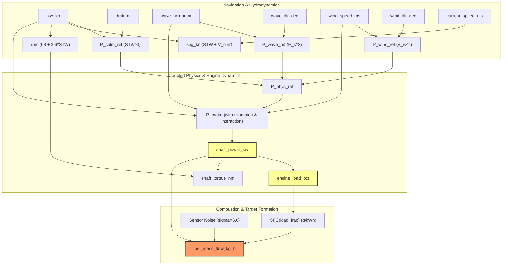

# Synthetic Target Mathematical Dependency Audit
**Document ID:** `AUDIT-SYNTH-TARGET-001`  
**Target Variable:** `fuel_mass_flow_kg_h` $(F_t)$  
**Generator Source:** `data/synthetic_generator.py`  
**Software Version:** 0.2.1  
**Audit Date:** 2026-09-12  

---

## 1. Executive Summary
This document provides a mathematical lineage and dependency audit for the target channel `fuel_mass_flow_kg_h` generated by `data/synthetic_generator.py`. The objective is to explicitly map which operational, navigational, and environmental features are mathematically upstream of the synthetic fuel rate, establishing the physical and informational characteristics of the Phase 2 benchmark.

---

## 2. Mathematical Target Generation Equations

In `data/synthetic_generator.py` (lines 80–143), each observation $t$ is generated sequentially through the following physical chain:

### Step 1: Hydrodynamic Reference Power Calculation
Speed Through Water ($STW$, in knots) is sampled from a nominal distribution. Environmental variables (wave height $H_s$, wave direction $\theta_{\text{wave}}$, wind speed $V_{\text{wind}}$, wind direction $\theta_{\text{wind}}$, current speed $V_{\text{curr}}$, current direction $\theta_{\text{curr}}$) are sampled.

The reference calm-water and added resistances are calculated:
$$P_{\text{calm\_ref}} = c_{\text{calm}} \cdot (STW)^3 \cdot \left(\frac{T_{\text{draft}}}{T_{\text{mean}}}\right)^{0.6}$$
$$P_{\text{wave\_ref}} = H_s^2 \cdot 110.0 \cdot \max(0.2, \cos(\theta_{\text{wave}} - \theta_{\text{heading}}))$$
$$P_{\text{wind\_ref}} = 0.4 \cdot V_{\text{wind}}^2 \cdot \max(0.1, \cos(\theta_{\text{wind}} - \theta_{\text{heading}}))$$
$$P_{\text{phys\_ref}} = P_{\text{calm\_ref}} + P_{\text{wave\_ref}} + P_{\text{wind\_ref}}$$

### Step 2: Non-Linear Model Mismatch & Operating Power
Controlled model mismatch is introduced to prevent identity evaluation:
$$\Delta P_{\text{mismatch}} = 0.05 \cdot (STW)^{3.15} - 0.04 \cdot (STW)^{3.0}$$
$$\Delta P_{\text{env\_interaction}} = 12.0 \cdot \frac{H_s \cdot V_{\text{wind}}}{10.0}$$
$$\eta_{\text{drift}} \sim \mathcal{N}(0, 0.02^2)$$
$$P_{\text{brake}} = \text{clip}\Big((P_{\text{phys\_ref}} + \Delta P_{\text{mismatch}} + \Delta P_{\text{env\_interaction}}) \cdot (1 + \eta_{\text{drift}}), \, 450.0, \, P_{\text{max}}\Big)$$

**Identity Assignment:**
$$\text{shaft\_power\_kw} \equiv P_{\text{brake}}$$

### Step 3: Engine Load Fraction and Non-Linear SFC
Engine load fraction is derived directly from shaft power:
$$\text{load\_pct} = \frac{\text{shaft\_power\_kw}}{P_{\text{max}}} \cdot 100.0, \quad \text{load\_frac} = \frac{\text{load\_pct}}{100.0}$$

A load-dependent Specific Fuel Oil Consumption (SFC) curve is computed:
$$\text{SFC}(\text{load\_frac}) = \text{SFC}_{\text{base}} \cdot \Big(1.0 + 0.30 \cdot (\text{load\_frac} - 0.75)^2 - 0.04 \cdot (\text{load\_frac} - 0.5)^3\Big) \quad [\text{g/kWh}]$$

### Step 4: Final Fuel Mass Flow Rate
Target fuel mass flow rate is determined from shaft power and SFC with Gaussian sensor measurement noise:
$$\epsilon_{\text{meas}} \sim \mathcal{N}(0, 5.0^2)$$
$$\text{fuel\_mass\_flow\_kg\_h} = \text{clip}\left(\frac{\text{shaft\_power\_kw} \cdot \text{SFC}(\text{load\_frac})}{1000.0} + \epsilon_{\text{meas}}, \, 120.0, \, 3600.0\right)$$

### Auxiliary Variable: Shaft RPM
Shaft rotational speed is generated alongside STW:
$$\text{rpm} = \text{clip}(68.0 + 3.6 \cdot STW, \, 38.0, \, 142.0)$$
$$\text{shaft\_torque\_nm} = \frac{\text{shaft\_power\_kw} \cdot 1000.0}{2\pi \cdot (\text{rpm} / 60.0)}$$

---

## 3. Predictor Dependency Matrix

| Predictor Feature | Mathematically Upstream of Target? | Functional Relationship | Impact on Fuel Flow |
| :--- | :---: | :--- | :--- |
| **`shaft_power_kw`** | **YES (Direct)** | $F_t \propto \text{shaft\_power\_kw} \cdot \text{SFC}(\text{load})$ | **Dominant linear & cubic scaling** |
| **`engine_load_pct`** | **YES (Direct)** | Directly scales SFC via non-linear bathtub curve | Modulates SFC by $\pm 10\text{--}25\%$ |
| **`stw_kn`** | **YES (Indirect)** | Generates $P_{\text{calm\_ref}}$ via cubic power law | Determines base hydrodynamic power demand |
| **`sog_kn`** | **NO (Correlated)** | $SOG = STW + V_{\text{current\_along}} + \epsilon$ | Correlated with STW, but STW drives power |
| **`wave_height_m`** | **YES (Indirect)** | Adds resistance via $H_s^2$ and interaction | Increases power by $50\text{--}400\,\text{kW}$ |
| **`wind_speed_ms`** | **YES (Indirect)** | Adds aerodynamic drag via $V_{\text{wind}}^2$ | Increases power by $10\text{--}150\,\text{kW}$ |
| **`draft_m`** | **YES (Indirect)** | Scales calm-water resistance by $(T/T_{\text{mean}})^{0.6}$ | Modulates calm power by $\pm 5\%$ |
| **`rpm`** | **NO (Collinear)** | Correlated with $STW$ ($68 + 3.6 \cdot STW$) | Does not enter $F_t$ calculation directly |
| **`physics reference model`** | **YES (Structural)** | Provides baseline calm, wave, and wind power | Base energy level for the synthetic ground truth |

---

## 4. Mathematical Dependency Graph

---

## 5. Epistemic Interpretation & Experimental Scope

### 1. Why Upstream Dependency is NOT Data Leakage
In a marine propulsion powertrain, the physical relationship between engine brake power and instantaneous fuel rate is governed by internal combustion thermodynamics:
$$\dot{m}_{\text{fuel}}(t) = P_{\text{shaft}}(t) \cdot \text{SFC}(P_{\text{shaft}}(t), \text{rpm}(t)) + \epsilon(t)$$
Having `shaft_power_kw` mathematically upstream of `fuel_mass_flow_kg_h` accurately mirrors marine engineering physics. Telemetry channels measuring shaft torque and RPM provide instantaneous measurement of delivered power.

### 2. Instantaneous Operational Estimation vs. Future Lookahead Forecasting
Because `shaft_power_kw(t)` and `fuel_mass_flow_kg_h(t)` are contemporaneous observations measured at identical timestamp $t$:
- **Task Scope**: The model performs **instantaneous operational estimation** ($X(t) \to F(t)$).
- **Boundary Restriction**: This is strictly an instantaneous operational estimation problem, **NOT an autonomous voyage forecasting problem** ($X(t) \to F(t + \Delta t)$).
- **Physical Reason**: If one attempted to forecast fuel consumption 12 hours ahead, future `shaft_power_kw(t + 12\text{h})` would be unknown and would itself require prediction from route, speed, and weather forecast models.

### 3. Conclusion for Phase 2 Claims
The benchmark demonstrates that when shaft power is measured accurately via shaft torque meters, gradient-boosted trees can infer instantaneous fuel consumption with high precision (MAE 5.61 kg/h) by learning the empirical engine SFC curve. Conversely, naval architecture physics models that compute resistance from theoretical hydrodynamic drag tables without sea-trial calibration introduce systematic baseline offsets.
